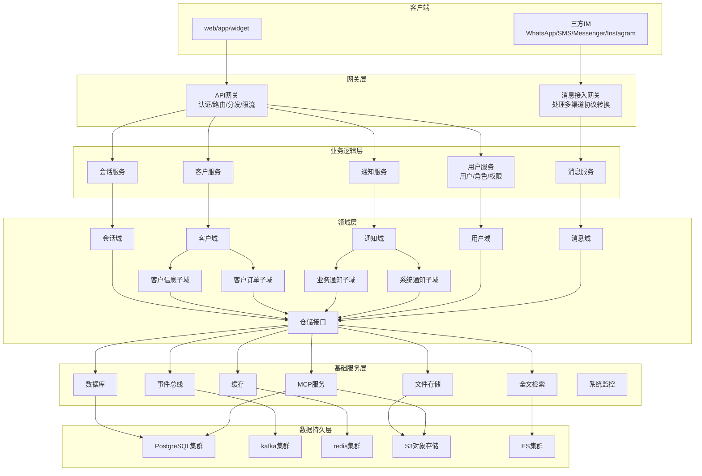

# 中小企业统一消息平台架构设计文档

## 1. 系统概述

### 1.1 背景需求

在后疫情时代，中小企业急需将传统电话/邮件沟通转型为以即时通讯(IM)为主的客户交互方式。本系统旨在提供：

*   多通道(短信、WhatsApp、Messenger等)统一收件箱
*   即时通讯优先的客户互动体验
*   集成化客户关系管理功能
*   可扩展的智能服务(聊天机器人、推荐引擎等)

### 1.2 设计原则

*   **统一接入**：标准化各消息通道接入
*   **实时响应**：保障消息低延迟处理
*   **弹性扩展**：支持业务量快速增长
*   **数据安全**：符合隐私保护法规要求

## 2. 整体架构

### 2.1 架构图




### 2.2 核心组件说明

**消息服务**：

*   WhatsApp适配器：处理WhatsApp Business API集成
*   SMS适配器：对接各大短信网关
*   社交平台适配器：Messenger/Instagram等对接
*   协议转换：统一内部消息格式

**核心服务层**：

*   会话服务：会话生命周期管理
*   客户服务：客户信息/订单
*   通知服务：业务/系统通知
*   用户服务：组织架构与权限控制


**基础设施**：

*   分布式事件总线：服务间异步通信
*   对象存储：消息附件管理
*   缓存系统：热点数据加速/会话状态管理

## 3. 详细设计

### 3.1 数据流设计

**入站消息流程**：

1.  消息接入网关接收原始消息
2.  转换为标准消息格式：

```json
{
  "channel_message_id": "uuidv4",
  "channel": "whatsapp",
  "direction": "inbound",
  "sender": "+8613800138000",
  "recipient": "business_account_id",
  "content": {
    "text": "销售线索",
    "attachments": []
  },
  "timestamp": "ISO8601",
  "metadata": {}
}
```

3.  发布"message.received"事件
4.  消息服务处理：
    *   去重检查
    *   会话关联
    *   敏感词过滤
5.  更新会话状态
6.  实时推送至客户端
7.  发布业务到达通知

**出站消息流程**：

1.  业务系统发起发送请求
2.  消息服务验证权限/配额
3.  发布"message.send"事件
4.  选择最优发送通道
5.  消息服务转换协议格式
6.  发送状态追踪：
    *   已发送
    *   已送达
    *   已读
7.  失败自动重试机制
8.  更新会话状态

### 3.2 数据存储方案

**主数据库(PostgreSQL)**：

```sql
-- 商家账户表
CREATE TABLE businesses (
    id UUID PRIMARY KEY,
    name VARCHAR(255) NOT NULL,
    status SMALLINT NOT NULL,
    plan  VARCHAR(20) NOT NULL,
    settings JSONB,
    created_at TIMESTAMPTZ DEFAULT NOW(),
    updated_at TIMESTAMPTZ DEFAULT NOW()
);

-- 商家用户表
CREATE TABLE business_account (
    id UUID PRIMARY KEY,
    name VARCHAR(50) NOT NULL,
    status SMALLINT NOT NULL,
    email  VARCHAR(128),
    role_id  REFERENCES business_role(id),
    last_login TIMESTAMPTZ,
    created_at TIMESTAMPTZ DEFAULT NOW(),
    updated_at TIMESTAMPTZ DEFAULT NOW()
);

-- 商家角色表
CREATE TABLE business_role (
    id UUID PRIMARY KEY,
    name VARCHAR(255) NOT NULL,
    status SMALLINT NOT NULL,
    perm_id text[] REFERENCES business_permission(id),
    created_at TIMESTAMPTZ DEFAULT NOW(),
    updated_at TIMESTAMPTZ DEFAULT NOW()
);

-- 商家权限表
CREATE TABLE business_permission (
    id UUID PRIMARY KEY,
    name VARCHAR(255) NOT NULL,
    code  VARCHAR(20) NOT NULL,
    created_at TIMESTAMPTZ DEFAULT NOW(),
    updated_at TIMESTAMPTZ DEFAULT NOW()
);

-- 会话表
CREATE TABLE conversations (
    id UUID PRIMARY KEY,
    business_id UUID REFERENCES businesses(id),
    customer_id UUID REFERENCES customers(id),
    account_id UUID REFERENCES business_account(id),
    channel VARCHAR(50) NOT NULL,
    status VARCHAR(20) CHECK (status IN ('open','follow','close')),
    unread_count INTEGER DEFAULT 0,
    last_message_at TIMESTAMPTZ,
    closed_at TIMESTAMPTZ,
    labels JSONB,
    created_at TIMESTAMPTZ DEFAULT NOW(),
    updated_at TIMESTAMPTZ DEFAULT NOW()
);

-- 消息表(分区表设计)
CREATE TABLE messages (
    id UUID PRIMARY KEY,
    conversation_id UUID REFERENCES conversations(id),
    direction VARCHAR(10) CHECK (direction IN ('inbound','outbound')),
    content TEXT,
    content_type VARCHAR(10) CHECK (content_type IN ('text','image','video')),
    status VARCHAR(20),
    channel_message_id TEXT,
    sent_at TIMESTAMPTZ,
    read_at TIMESTAMPTZ,
    error_reason TEXT,
    created_at TIMESTAMPTZ DEFAULT NOW(),
    updated_at TIMESTAMPTZ DEFAULT NOW()
) PARTITION BY RANGE (sent_at);

-- 客户表
CREATE TABLE customers (
    id UUID PRIMARY KEY,
    open_id VARCHAR(512) NOT NULL, //三方平台ID
    channel VARCHAR(20) NOT NULL,
    name VARCHAR(50) NOT NULL,
    phone VARCHAR(50),
    email  VARCHAR(128),
    metadata JSONB,
    created_at TIMESTAMPTZ DEFAULT NOW(),
    updated_at TIMESTAMPTZ DEFAULT NOW()
);

-- 客户订单表
CREATE TABLE customer_order (
    id UUID PRIMARY KEY,
    customer_id UUID REFERENCES customers(id),
    name VARCHAR(50) NOT NULL,
    shopify_id VARCHAR(512) NOT NULL,
    email  VARCHAR(128),
    last_order_id VARCHAR(128),
    order_cnt INT,
    order_amount BIGINT,
    created_at TIMESTAMPTZ DEFAULT NOW(),
    updated_at TIMESTAMPTZ DEFAULT NOW()
);

```

**存储策略**：

*   PostgreSQL: 存储账户、客户、订单、对话等结构化数据
*   Kafka: 存储上下行消息内容
*   Redis: 缓存频繁访问的数据(如用户会话、未读消息计数)
*   S3兼容存储: 存储消息附件(图片、视频、文档等)
*   ES存储: 会话内容、客户信息异步构建索引支撑全文检索


**缓存策略**：

*   Redis缓存结构：
    *   `conversation:{id}` - 会话最新状态
    *   `conversation_list:{business_id}` - 当前会话列表（Sorted Set）
    *   `account_sessions:{uid}` - 用户在线状态
    *   `rate_limit:{business}` - 发送频率控制

**读写模式**：

*   写操作：
    *   消息写入: 先写Kafka队列，然后异步持久化到PostgreSQL
    *   元数据变更: 直接写入PostgreSQL
*   读操作：
    *   最近对话: 优先从Redis读取
    *   历史消息: 从PostgreSQL分页查询
    *   客户信息: 从PostgreSQL读取，Redis缓存热点数据

### 3.3 关键API设计

**REST API**：

*   `POST /v1/messages` - 发送消息
    ```json
    {
      "conversation_id": "uuid",
      "content": {
        "text": "您好，请问有什么可以帮您？",
        "type": "text/image",
        "attachments": ["file_id1"]
      }
    }
    ```

*   `GET /v1/conversations` - 查询会话列表
    ```json
    {
      "status": "open",
      "channel": "whatsapp",
      "account_id": "business_account_id",
      "label": "VIP",
      "updated_after": "2025-05-01T00:00:00Z"
    }
    ```

**WebSocket API**：

*   连接端点：`wss://api.example.com/realtime`
*   订阅消息：
    ```json
    {
      "action": "subscribe",
      "topics": ["conversations", "messages:123"]
    }
    ```
*   实时事件推送：
    ```json
    {
      "event": "message.new",
      "data": {
        "conversation_id": "123e4567-e89b-12d3-a456-426614174000",
        "message": {...}
      }
    }
    ```

## 4. 非功能性需求

### 4.1 安全设计

*   **数据传输**：全链路TLS加密
*   **认证机制**：
    *   JWT访问令牌，短期token(1小时过期)
    *   通道签名验证(WhatsApp webhook签名等)
    *   基于角色的访问控制(RBAC)
*   **敏感数据**：
    *   消息内容加密存储
    *   API密钥HSM保护
    *   展示层脱敏显示
    *   敏感操作支持MFA验证
*   **合规要求**：
    *   消息保留策略配置
    *   GDPR合规：用户数据导出/删除功能
    *   各IM平台API使用合规(如WhatsApp Business API政策)
*   **审计日志**：
    *   记录所有敏感操作(登录、消息删除等)
    *   保留日志至少6个月

### 4.2 成功指标

| 指标项       | 目标值        |
| ------------ | ----------     |
| 消息处理延迟(p95)  | <500ms     |
| API响应时间(p99) | <1s        |
| 系统可用性        | 99.95% SLA |
| 单业务消息吞吐量     | 1000 msg/s |

| 业务指标项       | 目标值   |
| ------------ | ----------   |
| 每月活跃账户(MAU) | >1000 |
| 平均对话时长 | >5min     |
| 客户满意度(CSAT)  | 90% |

### 4.3 容灾方案

*   **多可用区部署**：关键服务跨AZ部署
*   **消息持久化**
*   **消息重试机制**：
    *   指数退避重试策略
    *   死信队列人工处理
*   **数据备份**：
    *   数据库每日快照
    *   消息日志长期归档(S3)
*   **自动化故障转移**

## 5. 扩展性设计

### 5.1 通道扩展流程

1.  实现新通道适配器接口：
    ```go
    type ChannelAdapter interface {
        Send(msg Message) (string, error)
        Receive(webhookData []byte) ([]Message, error)
        GetMessageStatus(messageID string) (MessageStatus, error)
    }
    ```
2.  注册到通道管理器
3.  配置通道权限策略
4.  上线灰度测试

### 5.2 水平扩展方案

*   **无状态服务**：通过k8s自动扩缩容
*   **数据分片**：
    *   按商家ID分库分表
    *   冷热数据分离
*   **读写分离**：
    *   写主库+读副本
    *   搜索走ES

### 5.3 边缘案例处理

*   **消息去重**：
    *   基于channel_message_id防止第三方平台消息重复处理
*   **最终一致性**：  
    *   对话未读计数可能短暂不一致
    *   采用补偿事务修复不一致
*   **大文件处理**：  
    *   分块上传/下载
    *   限制单个文件大小(如25MB)
*   **渠道限制**：  
    *   处理第三方平台速率限制(如WhatsApp消息频率限制)
    *   实现指数退避重试机制

## 6. 监控指标

### 6.1 核心监控看板

1.  **消息通道健康度**：
    *   各消息通道送达成功率
    *   消息延迟分布
    *   配额使用情况

2.  **业务活跃度**：
    *   日活跃商家数
    *   会话响应时长分布
    *   消息量趋势

3.  **系统资源**：
    *   服务CPU/内存使用率
    *   数据库连接池状态
    *   队列积压监控

### 6.2 关键告警项

*   消息通道连续失败>5次
*   消息积压>10,000
*   数据库CPU>80%持续5分钟
*   API错误率>1%

## 7. 典型场景示例

### 7.1 客户发起WhatsApp咨询

1.  客户点击网站WhatsApp图标
2.  WhatsApp适配器接收平台webhook
3.  系统创建新会话并分配客服
4.  实时推送至客服工作台
5.  客服响应后选择发送模板消息
6.  消息状态实时同步至双方

### 7.2 跨通道会话转移

1.  原会话通过短信通道
2.  客服识别客户有WhatsApp
3.  系统发送转移链接至客户WhatsApp
4.  新消息自动切换到WhatsApp通道
5.  历史会话记录保持完整关联

## 8. 演进路线

### 近期(0-3个月)

*   核心消息收发功能
*   WhatsApp+短信双通道支持
*   基础会话管理

### 中期(3-6个月)

*   智能路由分配
*   聊天机器人集成
*   客户标签体系

### 远期(6-12个月)

*   跨渠道客户画像
*   预测性服务建议
*   开放平台API
*   CRM集成
*   BI数据驱动

本设计文档提供了可落地的技术方案，在保障系统可靠性的同时，为后续功能扩展预留了充足的架构空间。建议采用迭代开发模式，优先实现核心消息通路，再逐步完善高级功能。
